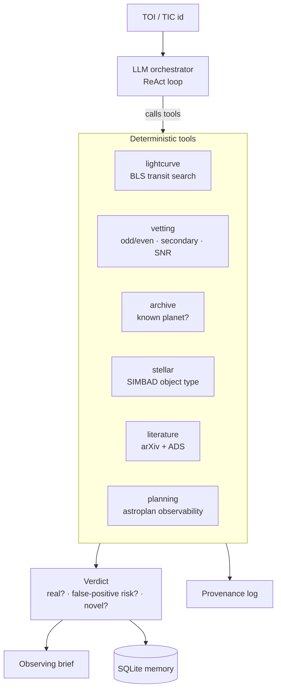

# 🔭 ExoScout

**Autonomous TESS candidate triage & follow-up planning agent.**


ExoScout takes a single TESS candidate (a TOI or TIC id) and runs the whole
first-pass triage an astronomer would: it vets the transit, decides whether it
is **already known or a likely false positive** against public science archives,
checks the literature, and plans ground-based follow-up — then writes a one-page
observing brief. An LLM agent decides which tools to call; the heavy compute
lives in deterministic, auditable tools.

> Verdicts are **decision-support with a human in the loop**, not authoritative
> discovery claims.

## How it works



Every numeric claim in the verdict traces back to a tool call in the provenance
log. No LLM available? The orchestrator falls back to a deterministic planner, so
it always runs.

## What it does

Six deterministic tools, an LLM agent that orchestrates them, a provenance log,
persistent memory, an exportable observing brief, and an evaluation harness.

**Tools** (`exoscout/tools/`)

1. **lightcurve** - fetch a TESS light curve (Lightkurve/MAST), clean/flatten,
   run a Box Least Squares transit search, phase-fold at the best period.
2. **vetting** - odd/even depth, secondary eclipse, depth-SNR and period-alias
   checks to catch eclipsing binaries, noise and wrong ephemerides. The
   transit-vetting CNN plugs in via `cnn_score`. See
   [Vetting statistics](#vetting-statistics) for how the significances are defined.
3. **archive** - NASA Exoplanet Archive TAP (TOI + confirmed tables): *"is this
   already known?"* plus coordinates and stellar parameters.
4. **stellar** - SIMBAD object-type lookup (catches known eclipsing binaries).
5. **literature** - arXiv (+ ADS if a token is set): *"has anyone published on it?"*
6. **planning** - astroplan observability across observatories over the next N
   nights (altitude / airmass / darkness / moon separation).

### Vetting statistics

Each diagnostic is expressed in units of *its own uncertainty*, so the thresholds
mean what they say:

| diagnostic | statistic | cut |
|---|---|---|
| transit depth | depth / standard error on the mean depth | 7.1σ (SPOC detection threshold) |
| odd vs even depth | difference / scatter **between individual transits** | 3σ |
| secondary eclipse | depth at phase 0.5 / its standard error | 3σ |

Two details matter. The per-point scatter is measured with a MAD-based estimator
outside both the primary and the secondary window, so a real secondary cannot
inflate the baseline. And the odd/even error bar comes from the spread of
individual transit depths rather than from white noise — red noise and a
slightly-wrong ephemeris would otherwise fake an eclipsing binary at many sigma.

**Period aliases.** An odd/even mismatch has two very different causes: an
eclipsing binary shows *two* eclipses of unequal depth, whereas folding at half
the true period puts real transits on one parity and bare baseline on the other.
ExoScout separates them by asking whether the shallower parity contains a transit
at all, and reports a suggested 2× period instead of a false-positive verdict.

> On TOI 700.01 the BLS search locks onto 8.026 d. ExoScout does not call the
> confirmed planet a false positive; it reports a suspected alias and suggests
> **16.053 d** — the catalogued period of TOI 700 c.

**Transit-vetting CNN** (`exoscout/ml/`)

An **AstroNet-style dual-view 1D CNN** (Shallue & Vanderburg 2018) trained on
real TESS data - confirmed planets vs. TFOPWG false positives. Global + local
phase-folded views feed two convolutional columns; the output P(planet) enters
the vetting tool through the `cnn_score` hook and sharpens the verdict.

Trained on 732 real TESS light curves (585 train / 147 validation):

| accuracy | precision | recall | F1 | ROC-AUC |
|---|---|---|---|---|
| 0.74 | 0.70 | 0.87 | 0.78 | **0.80** |

It adds an independent line of evidence to the rule-based checks: on TOI 700.01,
where the BLS period is a half-period alias and the classic odd/even test can
only say "the ephemeris is wrong", the CNN still scores P(planet) = 0.96 from the
folded shape alone.

```bash
python -m exoscout.ml.build_dataset --per-class 400  # build labeled set from MAST
python -m exoscout.ml.train --epochs 60              # train, save models/astronet.pt
```

**Around the tools**

- **Provenance log** - every claim traces back to a tool output.
- **Observing brief** (`exoscout/brief.py`) - one-page Markdown deliverable.
- **Memory** (`exoscout/store.py`) - SQLite log of every triage.
- **Evaluation** (`evaluate.py`) - novelty-classifier accuracy on a labeled TOI
  set (`data/labeled_tois.csv`). Currently 100% known/confirmed on the set.
- **Tests** (`tests/`) - offline pytest suite: `pytest -q`.

### Agent layer (`exoscout/agent/`)

An LLM orchestrator turns the six tools into an agentic loop: the model decides
which tool to call, reacts to each result, and writes the final verdict. It is
**LLM-optional** - with an OpenAI-compatible endpoint it runs a ReAct loop;
without one it falls back to a deterministic planner, so it always runs.

Two guards keep the loop honest with small local models. Identical tool calls are
**memoised within a run**, so a model that asks for the light curve three times
pays for one MAST download rather than three. And if the step budget runs out
while the model is still calling tools, ExoScout makes one final call with tools
disabled, so a run always ends in a brief instead of silence.

```bash
python agent_cli.py "TOI 700.01"                 # LLM if available
python agent_cli.py "TIC 150428135" --deterministic
```

LLM config (env vars, all optional):

```
EXOSCOUT_LLM_BASE_URL   default http://localhost:11434/v1   (local Ollama)
EXOSCOUT_LLM_MODEL      default llama3.2
EXOSCOUT_LLM_API_KEY    default "ollama" (use a real key for hosted APIs)
```

## Roadmap

- Split into orchestrator + specialist sub-agents.
- Re-fold automatically at the suggested period when an alias is detected.
- Expand the evaluation set (false positives, hallucination checks per claim).

## Setup

```bash
pip install -r requirements.txt
streamlit run app.py
```

Then enter a target like `TOI 700.01`, `TIC 150428135`, or a bare TIC number.

Command line:

```bash
python agent_cli.py "TOI 700.01" --brief      # full triage + observing brief
python evaluate.py                            # novelty-classifier accuracy
pytest -q                                     # offline test suite
```

All data comes from free public APIs (NASA Exoplanet Archive TAP, MAST via
Lightkurve, arXiv, SIMBAD) - no credentials required. ADS is optional (set
`ADS_TOKEN` for richer literature results).

## Engineering notes

- **Auditable by design.** Tools are pure functions returning plain dicts and
  never raise for expected failures; every claim is logged to a provenance trail.
- **No claim without evidence.** The verdict is gated on the tools that actually
  succeeded: a failed literature search yields *"not in archive (literature
  unchecked)"*, never *"novel"*, and every field carries the reasons behind it.
  Absence of a search is not evidence of absence.
- **Graceful degradation.** A flaky archive or an unreachable SIMBAD marks that
  step failed and the pipeline continues - a triage never crashes on one tool.
- **Response cache** (`exoscout/cache.py`) with TTL respects API rate limits and
  makes repeat queries ~500x faster.
- **Location-independent.** All on-disk state resolves through `exoscout/paths.py`
  relative to the package, not the working directory, and each location can be
  overridden (`EXOSCOUT_DATA_DIR`, `EXOSCOUT_MODEL_DIR`, `EXOSCOUT_CACHE_DIR`).
- **Tested + CI.** Offline `pytest` suite runs on every push via GitHub Actions.
  The vetting checks are pinned by synthetic light curves with a known answer -
  a clean planet, an eclipsing binary, a secondary eclipse, a period alias and
  pure noise - so a regression in the statistics fails the build.

> Verdicts are **decision-support with a human in the loop**, not authoritative
> discovery claims.
