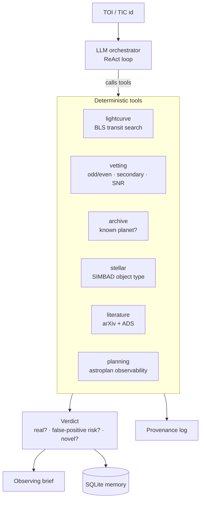

# 🔭 ExoScout

**Autonomous TESS candidate triage & follow-up planning agent.**


ExoScout takes a single TESS candidate (a TOI or TIC id) and runs the whole
first-pass triage an astronomer would: it vets the transit, decides whether it
is **already known or a likely false positive** against public science archives,
checks the literature, and plans ground-based follow-up — then writes a one-page
observing brief. An LLM agent decides which tools to call; the heavy compute
lives in deterministic, auditable tools.

> Verdicts are **decision-support with a human in the loop**, not authoritative
> discovery claims.

## How it works



Every numeric claim in the verdict traces back to a tool call in the provenance
log. No LLM available? The orchestrator falls back to a deterministic planner, so
it always runs.

## What it does

Six deterministic tools, an LLM agent that orchestrates them, a provenance log,
persistent memory, an exportable observing brief, and an evaluation harness.

**Tools** (`exoscout/tools/`)

1. **lightcurve** - fetch a TESS light curve (Lightkurve/MAST), clean/flatten,
   run a Box Least Squares transit search, phase-fold at the best period.
2. **vetting** - odd/even depth, secondary eclipse, depth-SNR checks to catch
   eclipsing binaries and noise. The transit-vetting CNN plugs in via `cnn_score`.
3. **archive** - NASA Exoplanet Archive TAP (TOI + confirmed tables): *"is this
   already known?"* plus coordinates and stellar parameters.
4. **stellar** - SIMBAD object-type lookup (catches known eclipsing binaries).
5. **literature** - arXiv (+ ADS if a token is set): *"has anyone published on it?"*
6. **planning** - astroplan observability across observatories over the next N
   nights (altitude / airmass / darkness / moon separation).

**Around the tools**

- **Provenance log** - every claim traces back to a tool output.
- **Observing brief** (`exoscout/brief.py`) - one-page Markdown deliverable.
- **Memory** (`exoscout/store.py`) - SQLite log of every triage.
- **Evaluation** (`evaluate.py`) - novelty-classifier accuracy on a labeled TOI
  set (`data/labeled_tois.csv`). Currently 100% known/confirmed on the set.
- **Tests** (`tests/`) - offline pytest suite: `pytest -q`.

### Agent layer (`exoscout/agent/`)

An LLM orchestrator turns the four tools into an agentic loop: the model decides
which tool to call, reacts to each result, and writes the final verdict. It is
**LLM-optional** - with an OpenAI-compatible endpoint it runs a ReAct loop;
without one it falls back to a deterministic planner, so it always runs.

```bash
python agent_cli.py "TOI 700.01"                 # LLM if available
python agent_cli.py "TIC 150428135" --deterministic
```

LLM config (env vars, all optional):

```
EXOSCOUT_LLM_BASE_URL   default http://localhost:11434/v1   (local Ollama)
EXOSCOUT_LLM_MODEL      default llama3.2
EXOSCOUT_LLM_API_KEY    default "ollama" (use a real key for hosted APIs)
```

## Roadmap

- Split into orchestrator + specialist sub-agents.
- Wire in the real transit-vetting CNN via the `cnn_score` hook.
- Expand the evaluation set (false positives, hallucination checks per claim).

## Setup

```bash
pip install -r requirements.txt
streamlit run app.py
```

Then enter a target like `TOI 700.01`, `TIC 150428135`, or a bare TIC number.

Command line:

```bash
python agent_cli.py "TOI 700.01" --brief      # full triage + observing brief
python evaluate.py                            # novelty-classifier accuracy
pytest -q                                     # offline test suite
```

All data comes from free public APIs (NASA Exoplanet Archive TAP, MAST via
Lightkurve, arXiv, SIMBAD) - no credentials required. ADS is optional (set
`ADS_TOKEN` for richer literature results).

## Engineering notes

- **Auditable by design.** Tools are pure functions returning plain dicts and
  never raise for expected failures; every claim is logged to a provenance trail.
- **Graceful degradation.** A flaky archive or an unreachable SIMBAD marks that
  step failed and the pipeline continues - a triage never crashes on one tool.
- **Response cache** (`exoscout/cache.py`) with TTL respects API rate limits and
  makes repeat queries ~500x faster.
- **Tested + CI.** Offline `pytest` suite runs on every push via GitHub Actions.

> Verdicts are **decision-support with a human in the loop**, not authoritative
> discovery claims.
